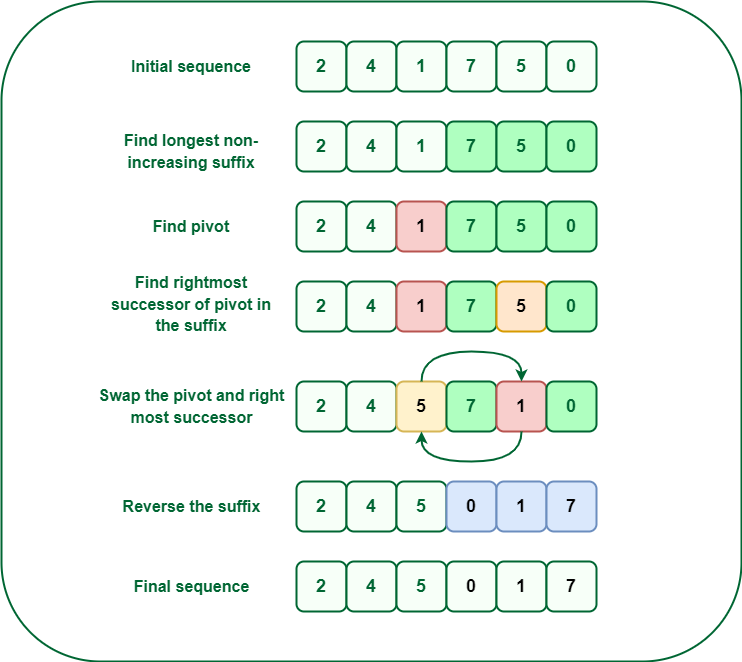

# Array Problems and Solutions

This repository contains solutions to a collection of **array-related problems**. Each solution is implemented in Python and optimized for performance and readability. The problems range from beginner to advanced levels, helping users improve their problem-solving skills in handling arrays.

---

## Problems Included

1. **Next Permutation**
    - **Description**: Rearranges the elements of an array into the next lexicographical order. If no such order exists, it rearranges into the smallest order (ascending).
    - **Difficulty**: Medium
    - **File**: `Next_Permutation.py`
   ####
   
2. 

---

